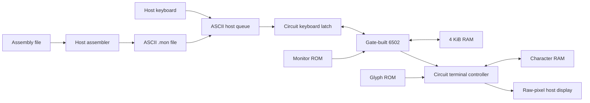

# Architecture

The [approved Apple-1 direction](apple1-direction.md) supersedes the bespoke ISA and stock-TTY plan. Target original NMOS 6502 semantics through native gate circuits. Coverage and native tests establish current support, not an opcode table alone.

Read [primitives](primitives.md), [ISA](isa.md), [memory/I/O](memory-and-io.md), and [clock/control](control.md). Historical M0 reports describe their own artifacts, not the current computer.

The monitor runs on the gate CPU and turns input characters into RAM writes.
The host never interprets an instruction or deposits program bytes. CPU storage
is built from gates; the console's single-bit DFFs and the RAM/ROM arrays are the
declared storage foundations. Follow native CPU → register bank → GateDff to
inspect the storage construction, or CPU → ALU → FullAdder for arithmetic.
