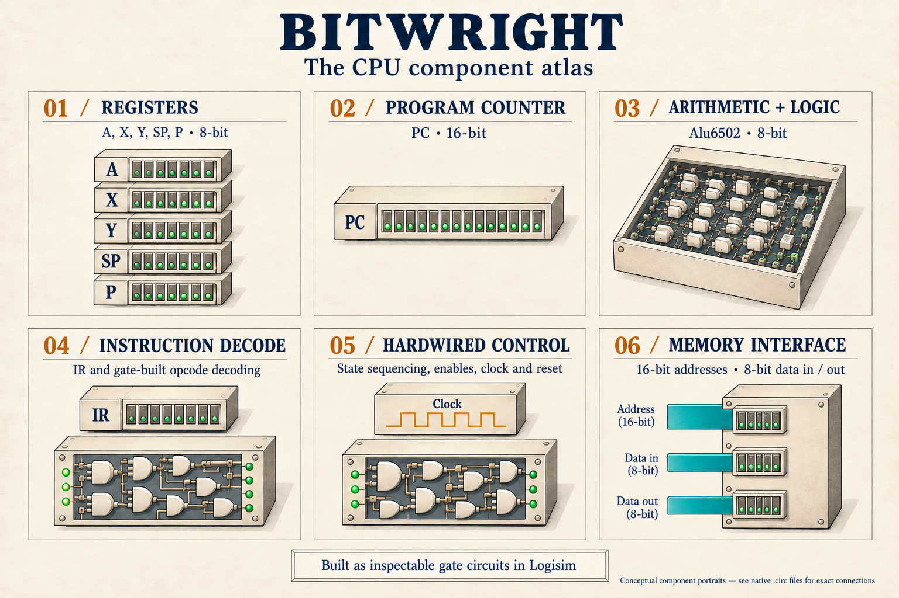
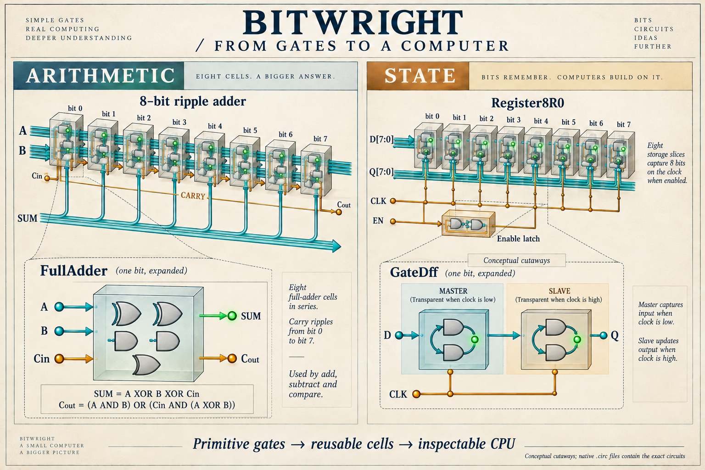
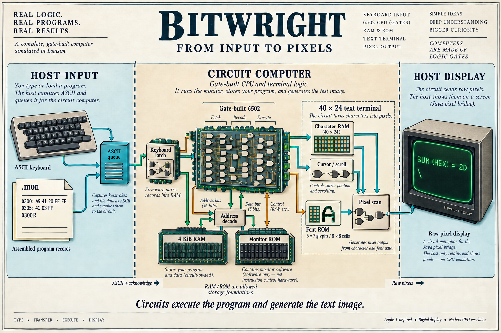

# Illustrated Bitwright architecture

These conceptual illustrations introduce the development candidate. They are
not screenshots or exact wiring diagrams. The [architecture contracts](../../../architecture/README.md)
and [native circuits](../../../circuits/README.md) define the implementation.

## CPU component atlas

The CPU contains 8-bit registers, a 16-bit program counter, arithmetic and logic,
opcode decoding, hardwired control and a memory interface. The atlas shows their
roles; inspect the native circuit for exact connections.

## Arithmetic and storage

One-bit adders compose arithmetic, while master/slave gate storage cells compose
registers. These are conceptual cutaways; the native FullAdder and GateDff
subcircuits expose the exact gates.

## From input to pixels

The host queues ASCII. Firmware executing on the circuit CPU interprets monitor
records and writes RAM. Circuit terminal logic owns character storage, glyph
lookup, cursor movement and scrolling; the host retains the emitted raw pixels.

The [generation prompts and selected-image provenance](prompts.json) accompany
the PNGs in the repository and offline package. The illustrations were generated
with ImageGen and refined to match the documented architecture. Refer to the
native sources when a simplified illustration omits detail.
